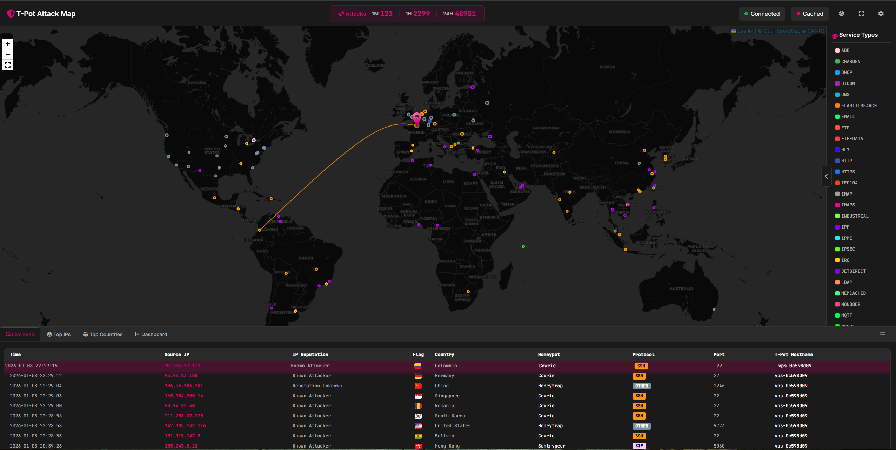
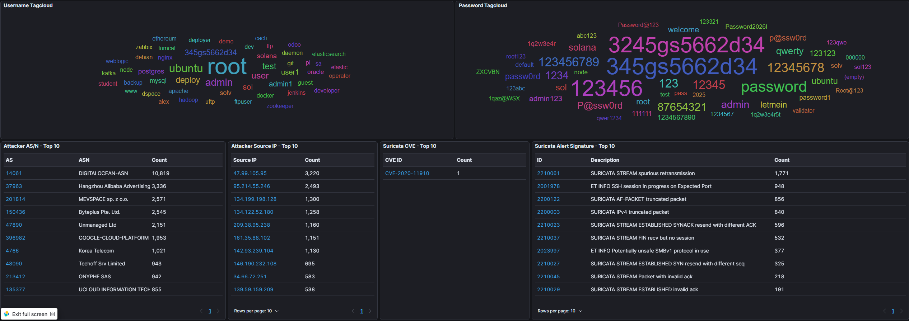
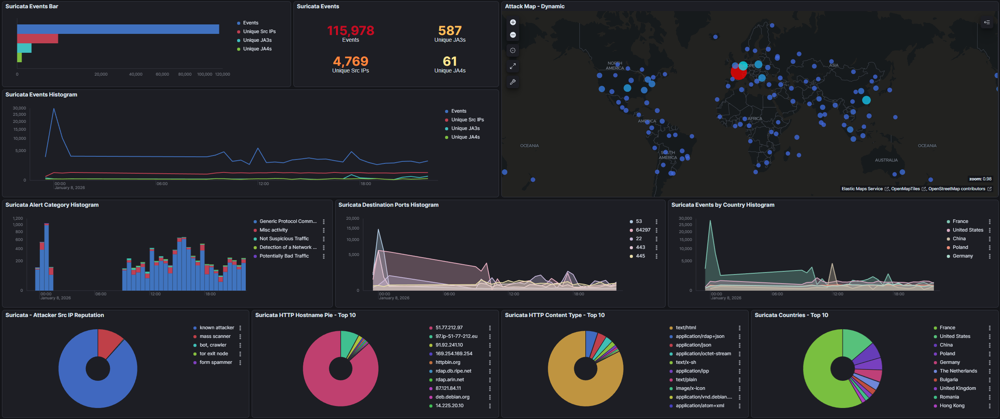

## Spreading honey on the web 

I recently made the acquisition of a brand new serv... VPS. I sadly can't rack a new server in, it is FULL AS F. (24U not enough tho but it came home for free so...)

I wanted for quite some time install a honeypot somewhere (at home or on a VPS) to see what a sole machine could face. 
So here I am, playing with this big boy (which in reality is quite small but I'm not that filthy rich yet) :

**6** cores, **12GB** RAM, **100GB** SSD and an **unlimited 1GB** connexion. *boom*.

I feel like it's so powerfull I could probably run Crysis 3 at 4 fps average.

<i>=> dixit the guy having like a 40 cores 220GB RAM NVME SDS storage over 10G DAC cluster</i> but whatever, let's have some fun and putting some honey on the web.
<br>

## <u> What is a honey-pot, how does it work and why would you even do that, like, wtf ? </u>
	
So, according to the internet and most likely [wikipedia](https://en.wikipedia.org/wiki/Honeypot_(computing)) : 
	
``
In computer terminology, a honeypot is a computer security mechanism set to detect, deflect, or, in some manner, counteract attempts at unauthorized use of information systems. Generally, a honeypot consists of data (for example, in a network site) that appears to be a legitimate part of the site which contains information or resources of value to attackers. It is actually isolated, monitored, and capable of blocking or analyzing the attackers. This is similar to police sting operations, colloquially known as "baiting" a suspect.
``

To put it in my own words, it's simply a trap. The metaphor of spreading honey to catch bears : you fake a system vulnerability or open ports and wait for bad guys/bots to show up and spam your fake vulnerability. 
	
Now as the reasons why you would do that, I can think of 3 :
	
- It's *fun*. Trapping bots and see them trying to run some commands or whatsoever.
-  It's *still fun*, but you can do it for reaserch reasons. What are the bots trying nowadays, which CVE are they trying, which users!passwords are they using, where do they come from (country / AS speaking) and doing stats about those logs.
- Which leads to the *most fun* part of it : **graphs**. We **love graphs**, some probably jerk off to them. Do not start pointing fingers, we're all grown adults here.


## <u> The cow that like honey </u>

I'll speak about the one I knew before starting this project : [cowrie](https://github.com/cowrie/cowrie).
	
It is probably one of the most known honeypot, which is used for ssh/telnet connexion. 
Simply load it up via docker, and redirect your port 22/tcp to your cowrie host port 2222, you'll start to see things moving.

```
docker run -p 2222:2222 cowrie/cowrie:latest
```

```
interlope@guinea-pig:~$ ssh heyyoutube@10.100.40.222 -p 2222
The authenticity of host '[10.100.40.222]:2222 ([10.100.40.222]:2222)' can't be established.
ED25519 key fingerprint is SHA256:MmxFN18Ua65KIc7ls2GXAxkQ0oHKNKpoeQ/tBVO5GOc.
This key is not known by any other names.
Are you sure you want to continue connecting (yes/no/[fingerprint])? yes
Warning: Permanently added '[10.100.40.222]:2222' (ED25519) to the list of known hosts.
heyyoutube@10.100.40.222's password:
Permission denied, please try again.
```

```
interlope@cowrie:~$ docker run -p 2222:2222 cowrie/cowrie:latest
/cowrie/cowrie-env/lib/python3.11/site-packages/twisted/conch/ssh/transport.py:110: CryptographyDeprecationWarning: TripleDES has been moved to cryptography.hazmat.decrepit.ciphers.algorithms.TripleDES and will be removed from cryptography.hazmat.primitives.ciphers.algorithms in 48.0.0.
  b"3des-cbc": (algorithms.TripleDES, 24, modes.CBC),
/cowrie/cowrie-env/lib/python3.11/site-packages/twisted/conch/ssh/transport.py:117: CryptographyDeprecationWarning: TripleDES has been moved to cryptography.hazmat.decrepit.ciphers.algorithms.TripleDES and will be removed from cryptography.hazmat.primitives.ciphers.algorithms in 48.0.0.
  b"3des-ctr": (algorithms.TripleDES, 24, modes.CTR),
2026-01-08T20:40:59+0000 [-] Reading configuration from ['/cowrie/cowrie-git/etc/cowrie.cfg.dist']
2026-01-08T20:41:00+0000 [-] Python Version 3.11.2 (main, Apr 28 2025, 14:11:48) [GCC 12.2.0]
2026-01-08T20:41:00+0000 [-] Twisted Version 25.5.0
2026-01-08T20:41:00+0000 [-] Cowrie Version 2.9.6.dev6+ge73958d3e
2026-01-08T20:41:00+0000 [-] Sensor UUID: 850f16f4-ec9f-11f0-8012-b2c7425c1004
2026-01-08T20:41:00+0000 [-] Loaded output engine: jsonlog
2026-01-08T20:41:00+0000 [twisted.scripts._twistd_unix.UnixAppLogger#info] twistd 25.5.0 (/cowrie/cowrie-env/bin/python3 3.11.2) starting up.
2026-01-08T20:41:00+0000 [twisted.scripts._twistd_unix.UnixAppLogger#info] reactor class: twisted.internet.epollreactor.EPollReactor.
2026-01-08T20:41:00+0000 [-] CowrieSSHFactory starting on 2222
2026-01-08T20:41:00+0000 [cowrie.ssh.factory.CowrieSSHFactory#info] Starting factory <cowrie.ssh.factory.CowrieSSHFactory object at 0x7fcd3108fcd0>
2026-01-08T20:41:00+0000 [-] Ready to accept SSH connections
2026-01-08T20:41:01+0000 [cowrie.ssh.factory.CowrieSSHFactory] No moduli, no diffie-hellman-group-exchange-sha1
2026-01-08T20:41:01+0000 [cowrie.ssh.factory.CowrieSSHFactory] No moduli, no diffie-hellman-group-exchange-sha256
2026-01-08T20:41:01+0000 [cowrie.ssh.factory.CowrieSSHFactory] New connection: 10.100.20.23:60226 (172.17.0.2:2222) [session: 7c60efd23782]
2026-01-08T20:41:01+0000 [HoneyPotSSHTransport,0,10.100.20.23] Remote SSH version: SSH-2.0-OpenSSH_10.0p2 Debian-7
2026-01-08T20:41:01+0000 [HoneyPotSSHTransport,0,10.100.20.23] SSH client hassh fingerprint: eeca2460550b9ded084ecf2f70a75356
2026-01-08T20:41:01+0000 [cowrie.ssh.transport.HoneyPotSSHTransport#debug] kex alg=b'curve25519-sha256' key alg=b'ssh-ed25519'
2026-01-08T20:41:01+0000 [cowrie.ssh.transport.HoneyPotSSHTransport#debug] outgoing: b'aes128-ctr' b'hmac-sha2-256' b'none'
2026-01-08T20:41:01+0000 [cowrie.ssh.transport.HoneyPotSSHTransport#debug] incoming: b'aes128-ctr' b'hmac-sha2-256' b'none'
2026-01-08T20:41:02+0000 [cowrie.ssh.transport.HoneyPotSSHTransport#debug] NEW KEYS
2026-01-08T20:41:02+0000 [cowrie.ssh.transport.HoneyPotSSHTransport#debug] starting service b'ssh-userauth'
2026-01-08T20:41:02+0000 [cowrie.ssh.userauth.HoneyPotSSHUserAuthServer#debug] b'heyyoutube' trying auth b'none'
2026-01-08T20:41:02+0000 [cowrie.ssh.userauth.HoneyPotSSHUserAuthServer#debug] b'heyyoutube' trying auth b'publickey'
2026-01-08T20:41:02+0000 [HoneyPotSSHTransport,0,10.100.20.23] public key attempt for user b'heyyoutube' of type b'ssh-ed25519' with fingerprint a5:81:35:3f:30:21:7e:12:81:b8:c6:b2:5c:b1:b5:68
2026-01-08T20:41:02+0000 [HoneyPotSSHTransport,0,10.100.20.23] public key login attempt for [b'heyyoutube'] failed
2026-01-08T20:41:02+0000 [cowrie.ssh.userauth.HoneyPotSSHUserAuthServer#debug] b'heyyoutube' failed auth b'publickey'
2026-01-08T20:41:02+0000 [cowrie.ssh.userauth.HoneyPotSSHUserAuthServer#debug] reason: ('Incorrect signature', None)
2026-01-08T20:41:06+0000 [cowrie.ssh.userauth.HoneyPotSSHUserAuthServer#debug] b'heyyoutube' trying auth b'password'
2026-01-08T20:41:06+0000 [HoneyPotSSHTransport,0,10.100.20.23] Could not read etc/userdb.txt, default database activated
2026-01-08T20:41:06+0000 [HoneyPotSSHTransport,0,10.100.20.23] login attempt [b'heyyoutube'/b'hey'] failed
2026-01-08T20:41:07+0000 [cowrie.ssh.userauth.HoneyPotSSHUserAuthServer#debug] b'heyyoutube' failed auth b'password'
2026-01-08T20:41:07+0000 [cowrie.ssh.userauth.HoneyPotSSHUserAuthServer#debug] unauthorized login: ()
```

We can see here that i tried to ssh into the machine with heyyoutube/hey and it logged it. This is nice, but we can push it.
Let's say we could create an entire fake filesystem where any password works and so we could trap the bots into a fake shell and see what they are trying to do ?

Create the folders where we will store the logs :
```bash
mkdir -p data/cowrie/{downloads,keys,log/tty}
```

Create the cowrie config to trap our bots :
```bash
cat > data/cowrie/keys/cowrie.cfg <<'EOF'
[honeypot]
hostname = srv04
log_path = log
download_path = dl

[ssh]
enabled = true
listen_endpoints = tcp:22:interface=0.0.0.0

[telnet]
enabled = true
listen_endpoints = tcp:23:interface=0.0.0.0

[output_jsonlog]
logfile = log/cowrie.json
EOF
```

Last configuration step, create the file that will accept whatever user!password combinaison :
```bash
cat > data/cowrie/keys/userdb.txt <<'EOF'
*:x:*
EOF
```

Create the docker-compose file :
```yml
services:
  cowrie:
    container_name: cowrie
    image: ghcr.io/telekom-security/cowrie:24.04.1
    restart: always
    tmpfs:
      - /tmp/cowrie:uid=2000,gid=2000
      - /tmp/cowrie/data:uid=2000,gid=2000
    ports:
      - "2222:22"
      - "2223:23"
    read_only: true
    volumes:
      - ./data/cowrie/downloads:/home/cowrie/cowrie/dl
      - ./data/cowrie/keys:/home/cowrie/cowrie/etc
      - ./data/cowrie/log:/home/cowrie/cowrie/log
      - ./data/cowrie/log/tty:/home/cowrie/cowrie/log/tty
    networks:
      - cowrie_net

networks:
  cowrie_net:
    driver: bridge
```

Fire it :
```bash
interlope@cowrie:~$ docker-compose up -d
[+] Running 1/0
 ✔ Container cowrie  Running                                                                               0.0s
```

Results :
```
interlope@guinea-pig:~$ ssh heyyoutube@10.100.40.222 -p 2222

The programs included with the Debian GNU/Linux system are free software;
the exact distribution terms for each program are described in the
individual files in /usr/share/doc/*/copyright.

Debian GNU/Linux comes with ABSOLUTELY NO WARRANTY, to the extent
permitted by applicable law.
heyyoutube@ubuntu:~$ whoami
heyyoutube
heyyoutube@ubuntu:~$ touch test
heyyoutube@ubuntu:~$ ls
test
heyyoutube@ubuntu:~$ cat test
heyyoutube@ubuntu:~$ exit
Connection to 10.100.40.222 closed.
```

There's a real filesystem, that allow us to create a file, read it, whatsoever. 

On the cowrie side, this is what we see : a BIG bunch of json. And do you knows what json means ? 

<u>It means it is time for **JQ** : </u>

- Do you want to see the logins attemps ? BIM

```bash
interlope@cowrie:~$ cat data/cowrie/log/cowrie.json | jq 'select(.eventid == "cowrie.login.success")'
{
  "eventid": "cowrie.login.success",
  "username": "heyyoutube",
  "fingerprint": "a5:81:35:3f:30:21:7e:12:81:b8:c6:b2:5c:b1:b5:68",
  "key": "ssh-ed25519 AAAAC3NzaC1lZDI1NTE5AAAAIKFfQgC3QqH4FZK56WbON+xsuG6wSWK23J7oQ3v2muB/",
  "type": "ssh-ed25519",
  "message": "public key login attempt for [heyyoutube] succeeded",
  "sensor": "ac946bf9fc91",
  "timestamp": "2026-01-08T21:04:27.250111Z",
  "src_ip": "10.100.20.23",
  "session": "b00737ac199d"
}
{
  "eventid": "cowrie.login.success",
  "username": "heyyoutube",
  "fingerprint": "a5:81:35:3f:30:21:7e:12:81:b8:c6:b2:5c:b1:b5:68",
  "key": "ssh-ed25519 AAAAC3NzaC1lZDI1NTE5AAAAIKFfQgC3QqH4FZK56WbON+xsuG6wSWK23J7oQ3v2muB/",
  "type": "ssh-ed25519",
  "message": "public key login attempt for [heyyoutube] succeeded",
  "sensor": "ac946bf9fc91",
  "timestamp": "2026-01-08T21:04:56.856681Z",
  "src_ip": "10.100.20.23",
  "session": "a0093071b009"
}
```

- Do you want to see the commands used ? BAM

```bash
interlope@cowrie:~$ cat data/cowrie/log/cowrie.json | jq -r 'select(.eventid == "cowrie.command.input") | .timestamp + " | " + .input'
2026-01-08T21:04:31.103868Z | exit
2026-01-08T21:05:00.038135Z | whoami
2026-01-08T21:05:02.410770Z | touch test
2026-01-08T21:05:02.783707Z | ls
2026-01-08T21:05:03.777663Z | cat test
2026-01-08T21:05:05.661542Z | exit
```

- Do you want to see the source IP ? BOUM

```bash
interlope@cowrie:~$ cat data/cowrie/log/cowrie.json | jq -r '.src_ip' | sort | uniq -c | sort -rn
     30 10.100.20.23
```

- Do you want to see the usernames used  ? BOUMv2

```bash
interlope@cowrie:~$ cat data/cowrie/log/cowrie.json | jq -r 'select(.username) | .username' | sort | uniq
heyyoutube
```

But I am not satisfied with only this much, i want MORE. Lets print the entire ssh session :
```bash
interlope@cowrie:~$ cat data/cowrie/log/cowrie.json  | jq -r '[.timestamp, .eventid, .message // .input // ""] | @tsv' | column -t -s $'\t'
2026-01-08T21:04:56.846202Z  cowrie.session.connect     New connection: 10.100.20.23:33208 (172.20.0.2:22) [session: a0093071b009]
2026-01-08T21:04:56.846761Z  cowrie.client.version      Remote SSH version: SSH-2.0-OpenSSH_10.0p2 Debian-7
2026-01-08T21:04:56.848828Z  cowrie.client.kex          SSH client hassh fingerprint: eeca2460550b9ded084ecf2f70a75356
2026-01-08T21:04:56.856197Z  cowrie.client.fingerprint  public key attempt for user heyyoutube of type ssh-ed25519 with fingerprint a5:81:35:3f:30:21:7e:12:81:b8:c6:b2:5c:b1:b5:68
2026-01-08T21:04:56.856681Z  cowrie.login.success       public key login attempt for [heyyoutube] succeeded
2026-01-08T21:04:56.877192Z  cowrie.client.size         Terminal Size: 112 42
2026-01-08T21:04:56.877691Z  cowrie.client.var          request_env: LANG=en_US.UTF-8
2026-01-08T21:05:00.038135Z  cowrie.command.input       CMD: whoami
2026-01-08T21:05:02.410770Z  cowrie.command.input       CMD: touch test
2026-01-08T21:05:02.783707Z  cowrie.command.input       CMD: ls
2026-01-08T21:05:03.777663Z  cowrie.command.input       CMD: cat test
2026-01-08T21:05:05.661542Z  cowrie.command.input       CMD: exit
2026-01-08T21:05:05.662835Z  cowrie.log.closed          Closing TTY Log: log/tty/761cb3fdd2a24fa4db91c4fbdad1b15de7959a937e51f3bac02fd7df8225567e after 8.8 seconds
2026-01-08T21:05:05.664262Z  cowrie.session.closed      Connection lost after 8.8 seconds
```

Anyway, that's all for this playground, let's spice things up.

## <u> Tpotce </u>

Everything we've done previously was to introduce what we could call : a [Rube Goldberg machine](https://en.wikipedia.org/wiki/Rube_Goldberg_machine) AKA [tpotce](https://github.com/telekom-security/tpotce)

According to their github page, T-Pot is the all in one, optionally distributed, multiarch (amd64, arm64) honeypot plattform, supporting 20+ honeypots and countless visualization options using the Elastic Stack, animated live attack maps and lots of security tools to further improve the deception experience.

It features 39 dockers running with, according to my own maths : 35. freakings 35 honeypots (including cowrie).
It runs with a sole linux command :  
``env bash -c "$(curl -sL https://github.com/telekom-security/tpotce/raw/master/install.sh)"``

PS : you will probably need to stop the exim4 service (mail) that uses the port 25/tcp for everything to work flawlessly.

Did i say **graphs** ? There's plenty of graphs. There's even a LIVE ATTACK MAP, which is crazy cool to show off : 

<br>

There's an *ELK (Elastic, Logstash and Kibana)* stack which already have a lot of dashboards (one per honeypot at least). This one is one of the most basic, it shows a global view of the honeypot logs :


<br>

But the most important part of this dashboard is at it's end : you can have a word cloud with every user!password used. And the bigger it is, the more it has been used.


<br>

There is also a nice Suricata dashboard, which features the HTTP Content, the User Agent and HTTP Method :



This is everything for today, this article will be updated in a month or so, to get more metrics.

spleenftw