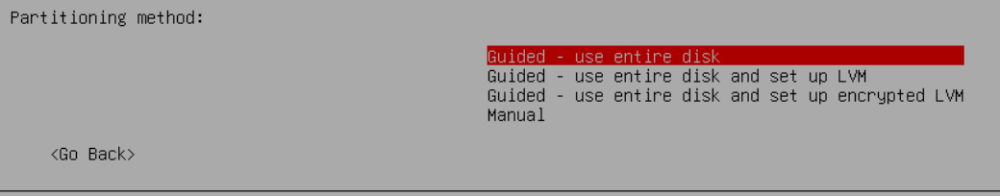
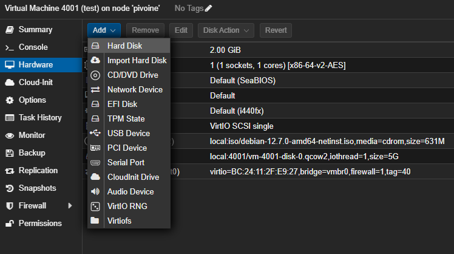
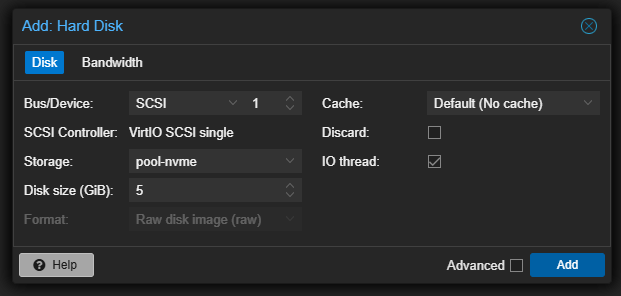
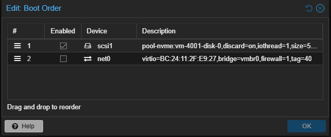
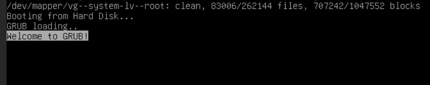

## **History**

A few years ago when I decided to go down the rabbit-hole of homelabbing, one of the first thing I did was a debian12-template.
Smart choice would you say :
- a perfect virtual machine that would be optimized
- configured like I wanted and needed (ssh keys, proxy & dns setup, ip settings, etc...)
- and an homogeneous fleet of VMs

Great, so now I can simply clone the template over and over for every need I have, right ? Right... ? Except for the simple fact that when I created the debian12-template, I made a mistake that i've to correct now : I did  **not** use  LVM.

## **Partitioning choices**
When you create a linux virtual machine, there's a step called **partitioning** (there are a few steps  before : *language choice*, *keyboard language*, *network configuration*, *root password*, *first user setup* and then the **partitioning** step)



We have 4 choices :
- Guided and using full disk (less flexible but quick and easy. To choose if you are sure you will **never** need to expand the partition)
- Guided and using full disk with LVM (flexible, you get logical volumes which gives you the ability to resize disks easily) 
- Guided and using full disk with encrypted LVM (same as the previous one but encrypted with LUKS. More secure but need entering a password at every boot, which we don't want since we would have to pass on every VM every host reboot)
- Manual (you get full control, you can do whatever you want, but then need more knowledge)

So the thing is, what choices do I have if I ever decided not to use LVM for **every**.**single**.**vm** in my homelab because of the mistake I made with the debian12-template a few years ago ?

To my knowledge, there's only 2 way : either restart everything from scratch or try to migrate every vm partitions' to a LVM one. Considering the lack of time, motivation and documentation I currently have, restart everything from scratch is off the table.

## **Current installation**

Let's assess what we currently have on our fresh debian12 installation :
```shell
root@debian:~# cat /etc/os-release
PRETTY_NAME="Debian GNU/Linux 12 (bookworm)"
```
I've installed docker and a few packages, to run a container called [uptime-kuma](https://github.com/louislam/uptime-kuma) just to see if it still works after migrating with curl.
```shell
root@debian:~# docker ps
CONTAINER ID   IMAGE                    COMMAND                  CREATED         STATUS                   PORTS                                       NAMES
a5fec5ba4df5   louislam/uptime-kuma:1   "/usr/bin/dumb-init …"   2 minutes ago   Up 2 minutes (healthy)   0.0.0.0:3001->3001/tcp, :::3001->3001/tcp   uptime-kuma
```
```shell
root@debian:~# curl localhost:3001
Found. Redirecting to /dashboardroot@debian:~#
```

For the disks and current partitioning :
```shell
root@debian:~# fdisk -l
Disk /dev/sda: 5 GiB, 5368709120 bytes, 10485760 sectors
Disk model: QEMU HARDDISK
Units: sectors of 1 * 512 = 512 bytes
Sector size (logical/physical): 512 bytes / 512 bytes
I/O size (minimum/optimal): 512 bytes / 512 bytes
Disklabel type: dos
Disk identifier: 0x3563c74a

Device     Boot   Start      End Sectors  Size Id Type
/dev/sda1  *       2048  8484863 8482816    4G 83 Linux
/dev/sda2       8486910 10483711 1996802  975M  5 Extended
/dev/sda5       8486912 10483711 1996800  975M 82 Linux swap / Solaris
```
```shell
root@debian:~# df -h | grep /dev
udev            965M     0  965M   0% /dev
/dev/sda1       4.0G  2.6G  1.2G  69% /
tmpfs           984M     0  984M   0% /dev/shm
```

So let's try to migrate our freshly installed debian 12 virtual machine 

## ** Migration**
**/!\ Before anything, create a snapshot or a backup ! /!\**

First thing first, we do need another disk so we have *somewhere* to migrate *to* :) 
Adding a disk on Proxmox is quite easy. Just go to the VM configuration and select the option to add another disk.



We should now see the new virtual disk we've just added :
```shell
root@debian:~# fdisk -l
Disk /dev/sdb: 5 GiB, 5368709120 bytes, 10485760 sectors
Disk model: QEMU HARDDISK
Units: sectors of 1 * 512 = 512 bytes
Sector size (logical/physical): 512 bytes / 512 bytes
I/O size (minimum/optimal): 512 bytes / 512 bytes


Disk /dev/sda: 5 GiB, 5368709120 bytes, 10485760 sectors
Disk model: QEMU HARDDISK
Units: sectors of 1 * 512 = 512 bytes
Sector size (logical/physical): 512 bytes / 512 bytes
I/O size (minimum/optimal): 512 bytes / 512 bytes
Disklabel type: dos
Disk identifier: 0x3563c74a

Device     Boot   Start      End Sectors  Size Id Type
/dev/sda1  *       2048  8484863 8482816    4G 83 Linux
/dev/sda2       8486910 10483711 1996802  975M  5 Extended
/dev/sda5       8486912 10483711 1996800  975M 82 Linux swap / Solaris
```

Now we want to partition the new disk, with fdisk : 
- **n** for a new partition
- **p** for a primary type
- **default** for the partition number (press enter to get the default choice)
- **default** for the first sector (press enter to get the default choice)
- **default** for the last sector (press enter to get the default choice)
- **t** to select a type
- **8e** to chose LVM type
- **a** to make it bootable
- **w** to save and apply (and exit)

```shell
root@debian:~# fdisk /dev/sdb

Welcome to fdisk (util-linux 2.38.1).
Changes will remain in memory only, until you decide to write them.
Be careful before using the write command.

Device does not contain a recognized partition table.
Created a new DOS (MBR) disklabel with disk identifier 0x931446ee.

Command (m for help): n
Partition type
   p   primary (0 primary, 0 extended, 4 free)
   e   extended (container for logical partitions)
Select (default p): p
Partition number (1-4, default 1):
First sector (2048-10485759, default 2048):
Last sector, +/-sectors or +/-size{K,M,G,T,P} (2048-10485759, default 10485759):

Created a new partition 1 of type 'Linux' and of size 5 GiB.

Command (m for help): t
Selected partition 1
Hex code or alias (type L to list all): 8e
Changed type of partition 'Linux' to 'Linux LVM'.

Command (m for help): a
Selected partition 1
The bootable flag on partition 1 is enabled now.

Command (m for help): w
The partition table has been altered.
Calling ioctl() to re-read partition table.
Syncing disks.
```

*Little tip for Linux: most of the time, when you’re prompted to make a choice and one option is in **capital letters**, it indicates the **default choice** that will be used if you just press Enter.*

So now, our disk */dev/sdb* has a partition (which we can check with `fdisk -l /dev/sdb` :
```shell
root@debian:~# fdisk -l /dev/sdb
Disk /dev/sdb: 5 GiB, 5368709120 bytes, 10485760 sectors
Disk model: QEMU HARDDISK
Units: sectors of 1 * 512 = 512 bytes
Sector size (logical/physical): 512 bytes / 512 bytes
I/O size (minimum/optimal): 512 bytes / 512 bytes
Disklabel type: dos
Disk identifier: 0x931446ee

Device     Boot Start      End  Sectors Size Id Type
/dev/sdb1  *     2048 10485759 10483712   5G 8e Linux LVM
```

We can now install a few packages that will help us to transfer files, use LVM and extend our partition size.
``apt update && apt install lvm2 rsync parted -y``


Now that `lvm2` is installed, we have to :
- create a physical volume with **pvcreate**. It is the LVM equivalent of a disk or partition. This tells LVM to use the partition /dev/sdb1 as part of its storage pool.
- create a volume group with **vgcreate**. It's like a box that will hold your logical volumes.
- create a logical volume for both the root and the swap with **lvcreate**. It's the partitions you'll use and resize if needed.

```shell
root@debian:~# pvcreate /dev/sdb1
  Physical volume "/dev/sdb1" successfully created.
root@debian:~# vgcreate vg-system /dev/sdb1
  Volume group "vg-system" successfully created
root@debian:~# lvcreate -L 1G -n lv-swap vg-system
  Logical volume "lv-swap" created.
root@debian:~# lvcreate -l 100%FREE -n lv-root vg-system
  Logical volume "lv-root" created.
```

We can then use the `mkfs.ext4` command to format the logical volume lv-root to ext4. And with  `mkswap` we can set up the lv-swap as... *swap* (who would've guessed, right ?)

```shell
root@debian:~# mkfs.ext4 /dev/vg-system/lv-root
mke2fs 1.47.0 (5-Feb-2023)
Discarding device blocks: done
Creating filesystem with 1047552 4k blocks and 262144 inodes
Filesystem UUID: 73265d61-1c37-4362-8298-c54e2488baa9
Superblock backups stored on blocks:
        32768, 98304, 163840, 229376, 294912, 819200, 884736

Allocating group tables: done
Writing inode tables: done
Creating journal (16384 blocks): done
Writing superblocks and filesystem accounting information: done
```
```shell
root@debian:~# mkswap /dev/vg-system/lv-swap
Setting up swapspace version 1, size = 1024 MiB (1073737728 bytes)
no label, UUID=4d315a61-ccb8-45aa-9647-f99399ac24ec
```

We have now to recreate the *filesystem structure* on the new logical volume lv-root and copy all the data on it :
```shell
mkdir  /mnt/newroot
mount /dev/vg-system/lv-root /mnt/newroot
```
```shell
rsync -avxHAX --progress --exclude=/mnt --exclude=/proc --exclude=/sys --exclude=/dev --exclude=/run --exclude=/tmp / /mnt/newroot/
```

You should see something like this at the end and no errors :
```shell
sent 2,529,433,716 bytes  received 1,376,360 bytes  53,280,212.13 bytes/sec
total size is 2,535,865,018  speedup is 1.00
```

It is time now to mount the new root filesystem (devices, processes, sysfs, and runtime environment) :
```shell
mkdir -p /mnt/newroot/{dev,proc,sys,run,tmp}
mount --bind /dev /mnt/newroot/dev
mount --bind /proc /mnt/newroot/proc
mount --bind /sys /mnt/newroot/sys
mount --bind /run /mnt/newroot/run
```
 
Now that the new root filesystem is ready and all the special filesystems are mounted, we can chroot into it and finalize the setup:
```shell
root@debian:~# chroot /mnt/newroot
root@debian:/#
```

Inside the chroot, we will now create the fstab file so that the system knows how to mount the new volumes at boot. 

<u>Tip </u>* I’m using the EOF block so that everything between the first *<< 'EOF'* and the *final EOF* gets written into the /etc/fstab file.*
<br>It’s simply a way to insert a block of text into a file directly from the shell without using a text-editor like *nano*,*n.vi.m* or even *echo*.
```shell
cat > /etc/fstab << 'EOF'
# LVM Configuration
/dev/vg-system/lv-root  /       ext4    defaults        0       1
/dev/vg-system/lv-swap  none    swap    sw              0       0

# Temporary filesystems
tmpfs                   /tmp    tmpfs   defaults,nodev,nosuid,noexec 0 0
EOF
```

We now need to regenerate the **initramfs**, an early-boot filesystem that includes all the drivers and tools the kernel needs to find and mount the root filesystem :
```shell
root@debian:/# update-initramfs -u -k all
update-initramfs: Generating /boot/initrd.img-6.1.0-39-amd64
update-initramfs: Generating /boot/initrd.img-6.1.0-25-amd64
```

Next, we need to install the **bootloader** GRUB, so our system knows how to boot.
```shell
root@debian:/# grub-install /dev/sdb
Installing for i386-pc platform.
Installation finished. No error reported.
```

After that, we regenerate GRUB’s configuration :
```shell
root@debian:/# update-grub
Generating grub configuration file ...
Found linux image: /boot/vmlinuz-6.1.0-39-amd64
Found initrd image: /boot/initrd.img-6.1.0-39-amd64
Found linux image: /boot/vmlinuz-6.1.0-25-amd64
Found initrd image: /boot/initrd.img-6.1.0-25-amd64
Warning: os-prober will not be executed to detect other bootable partitions.
Systems on them will not be added to the GRUB boot configuration.
Check GRUB_DISABLE_OS_PROBER documentation entry.
done
```

We can exit the chroot, dismount the */dev*, */proc*, */sys* and */run* that we previously mounter, shut the vm down and disable the old disk, select the new disk in the boot order and simply boot the virtual machine up.
```shell
umount /mnt/newroot/dev
umount /mnt/newroot/proc
umount /mnt/newroot/sys
umount /mnt/newroot/run
umount /mnt/newroot
```

In the boot order of you virtual machine, you should only see the network card and the new disk you've juste migrated to.


We are now booting on the new disk with LVM !


## Verification and testing
First thing first, let's check our disks with `fdisk -l` and a `df -h`: 
```shell
root@debian:~# fdisk -l
Disk /dev/sda: 5 GiB, 5368709120 bytes, 10485760 sectors
Disk model: QEMU HARDDISK
Units: sectors of 1 * 512 = 512 bytes
Sector size (logical/physical): 512 bytes / 512 bytes
I/O size (minimum/optimal): 512 bytes / 512 bytes
Disklabel type: dos
Disk identifier: 0x931446ee

Device     Boot Start      End  Sectors Size Id Type
/dev/sda1  *     2048 10485759 10483712   5G 8e Linux LVM


Disk /dev/mapper/vg--system-lv--swap: 1 GiB, 1073741824 bytes, 2097152 sectors
Units: sectors of 1 * 512 = 512 bytes
Sector size (logical/physical): 512 bytes / 512 bytes
I/O size (minimum/optimal): 512 bytes / 512 bytes


Disk /dev/mapper/vg--system-lv--root: 4 GiB, 4290772992 bytes, 8380416 sectors
Units: sectors of 1 * 512 = 512 bytes
Sector size (logical/physical): 512 bytes / 512 bytes
I/O size (minimum/optimal): 512 bytes / 512 bytes
```
```shell
root@debian:~# df -h
Filesystem                       Size  Used Avail Use% Mounted on
udev                             963M     0  963M   0% /dev
tmpfs                            197M  584K  197M   1% /run
/dev/mapper/vg--system-lv--root  3.9G  2.6G  1.1G  71% /
tmpfs                            984M     0  984M   0% /dev/shm
tmpfs                            5.0M     0  5.0M   0% /run/lock
tmpfs                            984M     0  984M   0% /tmp
overlay                          3.9G  2.6G  1.1G  71% /var/lib/docker/overlay2/ab90d480e6ec488256582f1bd9cff1a19bf69d1d2bf5f7c4bf7b66c4f5de9764/merged
tmpfs                            197M     0  197M   0% /run/user/1000
```

Then let's check our LVM configuration with LVM with `pvs`, `vgs` and `lvs` :
```shell
root@debian:~# pvs
  PV         VG        Fmt  Attr PSize  PFree
  /dev/sda1  vg-system lvm2 a--  <5.00g    0
```
```shell
root@debian:~# vgs
  VG        #PV #LV #SN Attr   VSize  VFree
  vg-system   1   2   0 wz--n- <5.00g    0
```
```shell
root@debian:~# lvs
  LV      VG        Attr       LSize  Pool Origin Data%  Meta%  Move Log Cpy%Sync Convert
  lv-root vg-system -wi-ao---- <4.00g
  lv-swap vg-system -wi-ao----  1.00g
```

Our final test will be to see if our docker is still runnig and working with `docker ps` and ```curl``` :

```shell
root@debian:~# docker ps
CONTAINER ID   IMAGE                    COMMAND                  CREATED       STATUS                   PORTS                                       NAMES
a5fec5ba4df5   louislam/uptime-kuma:1   "/usr/bin/dumb-init …"   4 hours ago   Up 5 minutes (healthy)   0.0.0.0:3001->3001/tcp, :::3001->3001/tcp   uptime-kuma
```
```shell
root@debian:~# curl localhost:3001
Found. Redirecting to /dashboardroot@debian:~#
```

## Expanding your VM disk space
So **all of this** was to one day, if needed, I could expand my VM disk storage.
In Proxmox, *Hardware* > click on the Hard Drive you want to expand > *Disk Actions* > *Resize*.
Let's say I added 5 more Gigs, because the current 5G I gave the VM are not enough, we now have 10G disk storage, but only 5G are used by the filesystem.
```shell
root@debian:~# fdisk -l
Disk /dev/sda: 10 GiB, 10737418240 bytes, 20971520 sectors
Disk model: QEMU HARDDISK
Units: sectors of 1 * 512 = 512 bytes
Sector size (logical/physical): 512 bytes / 512 bytes
I/O size (minimum/optimal): 512 bytes / 512 bytes
Disklabel type: dos
Disk identifier: 0x931446ee

Device     Boot Start      End  Sectors Size Id Type
/dev/sda1  *     2048 10485759 10483712   5G 8e Linux LVM


Disk /dev/mapper/vg--system-lv--swap: 1 GiB, 1073741824 bytes, 2097152 sectors
Units: sectors of 1 * 512 = 512 bytes
Sector size (logical/physical): 512 bytes / 512 bytes
I/O size (minimum/optimal): 512 bytes / 512 bytes


Disk /dev/mapper/vg--system-lv--root: 4 GiB, 4290772992 bytes, 8380416 sectors
Units: sectors of 1 * 512 = 512 bytes
Sector size (logical/physical): 512 bytes / 512 bytes
I/O size (minimum/optimal): 512 bytes / 512 bytes
```

We can see that we have a single partition, */dev/sda1*. We'll use `parted` to manage disk partitions :
```shell
root@debian:~# parted /dev/sda
GNU Parted 3.5
Using /dev/sda
Welcome to GNU Parted! Type 'help' to view a list of commands.
(parted) print
Model: QEMU QEMU HARDDISK (scsi)
Disk /dev/sda: 10.7GB
Sector size (logical/physical): 512B/512B
Partition Table: msdos
Disk Flags:

Number  Start   End     Size    Type     File system  Flags
 1      1049kB  5369MB  5368MB  primary               boot, lvm

(parted)  resizepart 1 100%
 ```

We can verify that the entire 10GB is now allocated to /dev/sda1:
```shell
(parted) print
Model: QEMU QEMU HARDDISK (scsi)
Disk /dev/sda: 10.7GB
Sector size (logical/physical): 512B/512B
Partition Table: msdos
Disk Flags:

Number  Start   End     Size    Type     File system  Flags
 1      1049kB  10.7GB  10.7GB  primary               boot, lvm
```

Next, we resize our LVM *Physical Volume* with `pveresize` and check that the newly available space (5GB) is recognized:
```shell
root@debian:~# pvresize /dev/sda1
  Physical volume "/dev/sda1" changed
  1 physical volume(s) resized or updated / 0 physical volume(s) not resized
```

Then we verify that the Volume Group sees the free space with `vgs`:
```shell
root@debian:~# vgs
  VG        #PV #LV #SN Attr   VSize   VFree
  vg-system   1   2   0 wz--n- <10.00g 5.00g
```

We extend the Logical Volume using  `lvextend`:
```shell
root@debian:~# lvextend -l +100%FREE /dev/vg-system/lv-root
  Size of logical volume vg-system/lv-root changed from <4.00 GiB (1023 extents) to <9.00 GiB (2303 extents).
  Logical volume vg-system/lv-root successfully resized.
```

Finally, we resize the filesystem to use the new space with `resize2fs` :
```shell
root@debian:~# resize2fs /dev/vg-system/lv-root
resize2fs 1.47.0 (5-Feb-2023)
Filesystem at /dev/vg-system/lv-root is mounted on /; on-line resizing required
old_desc_blocks = 1, new_desc_blocks = 2
The filesystem on /dev/vg-system/lv-root is now 2358272 (4k) blocks long.
```

We can check with `df -h` that the root filesystem now has more available space:
```shell
root@debian:~# df -h | grep root
/dev/mapper/vg--system-lv--root  8.8G  2.6G  5.8G  31% /
```

## Renaming
Let's take a look at my brand new debian12-template that has LVM :
```shell
root@deb12-template:~# df -h | grep root
/dev/mapper/deb12--template--vg-root   15G  1.7G   12G  13% /
```

If you ever clone it and rename the host (with `hostnamectl sethostname` and editing */etc/hosts* ), you'll be stuck with the same VG name. And you may want to rename it. Here's are a few steps to achieve that :
- using `vgrename` to rename the VG (make sense)
- updating */etc/fstab* with the new VG name
- updating */etc/initramfs-tools/conf.d/resume* (if you have swap)
- regenerating the *initramfs* 
- updating *grub*

Step one : <u> using vgrename to rename the VG (make sense) </u>

Here I decided to rename it system-vg but you can rename it whatever suits you.
```shell
root@deb12-template:~# vgs
  VG                #PV #LV #SN Attr   VSize   VFree
  deb12-template-vg   1   2   0 wz--n- <15.52g    0
root@deb12-template:~# vgrename deb12-template-vg system-vg
  Volume group "deb12-template-vg" successfully renamed to "system-vg"
root@deb12-template:~# vgs
  VG        #PV #LV #SN Attr   VSize   VFree
  system-vg   1   2   0 wz--n- <15.52g    0
```

Step two : <u> updating */etc/fstab/* with the new VG name </u>

My current */etc/fstab* is currently looking like this :
```shell
root@deb12-template:~# cat /etc/fstab
# /etc/fstab: static file system information.
#
# Use 'blkid' to print the universally unique identifier for a
# device; this may be used with UUID= as a more robust way to name devices
# that works even if disks are added and removed. See fstab(5).
#
# systemd generates mount units based on this file, see systemd.mount(5).
# Please run 'systemctl daemon-reload' after making changes here.
#
# <file system> <mount point>   <type>  <options>       <dump>  <pass>
/dev/mapper/deb12--template--vg-root /               ext4    errors=remount-ro 0       1
# /boot was on /dev/sda1 during installation
UUID=f4ca6e38-0263-4fe1-95f1-dc0cf9449ce2 /boot           ext2    defaults        0       2
/dev/mapper/deb12--template--vg-swap_1 none            swap    sw              0       0
/dev/sr0        /media/cdrom0   udf,iso9660 user,noauto     0       0
```

You want to replace the *deb12-template* with *system*. Using vi(m), it is simple with `:%s/oldtexttoreplace/replacement/g`, which would be `:%s/deb12--template/system/g`. So now, my */etc/fstab* is now looking like this :
```shell
root@deb12-template:~# cat /etc/fstab
# /etc/fstab: static file system information.
#
# Use 'blkid' to print the universally unique identifier for a
# device; this may be used with UUID= as a more robust way to name devices
# that works even if disks are added and removed. See fstab(5).
#
# systemd generates mount units based on this file, see systemd.mount(5).
# Please run 'systemctl daemon-reload' after making changes here.
#
# <file system> <mount point>   <type>  <options>       <dump>  <pass>
/dev/mapper/system--vg-root /               ext4    errors=remount-ro 0       1
# /boot was on /dev/sda1 during installation
UUID=f4ca6e38-0263-4fe1-95f1-dc0cf9449ce2 /boot           ext2    defaults        0       2
/dev/mapper/system--vg-swap_1 none            swap    sw              0       0
/dev/sr0        /media/cdrom0   udf,iso9660 user,noauto     0       0
```

Step three (optionnal, only if you have swap) : <u> updating /etc/initramfs-tools/conf.d/resume </u>

```shell
root@deb12-template:~# cat /etc/initramfs-tools/conf.d/resume
RESUME=/dev/mapper/deb12--template--vg-swap_1
```
Once again, we replace the *deb12--template* with *system*.
```shell
root@deb12-template:~# cat /etc/initramfs-tools/conf.d/resume
RESUME=/dev/mapper/system--vg-swap_1
```

Step four : <u> regenerating the initramfs </u>

This part should be the easiest one if everything else before runned smoothly. We will regenerating the initramfs with *update-initramfs -u -k all* :
```shell
root@deb12-template:~# update-initramfs -u -k all
update-initramfs: Generating /boot/initrd.img-6.1.0-39-amd64
update-initramfs: Generating /boot/initrd.img-6.1.0-25-amd64
```

Last step : <u> updating grub </u>

We now have to update the */boot/grub/grub.cfg* which still has the deb12--template VG name.
```shell
root@deb12-template:~# cat /boot/grub/grub.cfg | grep deb12--template
        linux   /vmlinuz-6.1.0-39-amd64 root=/dev/mapper/deb12--template--vg-root ro  quiet
                linux   /vmlinuz-6.1.0-39-amd64 root=/dev/mapper/deb12--template--vg-root ro  quiet
                linux   /vmlinuz-6.1.0-39-amd64 root=/dev/mapper/deb12--template--vg-root ro single
                linux   /vmlinuz-6.1.0-25-amd64 root=/dev/mapper/deb12--template--vg-root ro  quiet
                linux   /vmlinuz-6.1.0-25-amd64 root=/dev/mapper/deb12--template--vg-root ro single
```

Again, we'll use n.vi.m and `:%s/x/y/g` to replace every occurence of *deb12--template*

```shell
root@deb12-template:~# cat /boot/grub/grub.cfg | grep system
        linux   /vmlinuz-6.1.0-39-amd64 root=/dev/mapper/system--vg-root ro  quiet
                linux   /vmlinuz-6.1.0-39-amd64 root=/dev/mapper/system--vg-root ro  quiet
                linux   /vmlinuz-6.1.0-39-amd64 root=/dev/mapper/system--vg-root ro single
                linux   /vmlinuz-6.1.0-25-amd64 root=/dev/mapper/system--vg-root ro  quiet
                linux   /vmlinuz-6.1.0-25-amd64 root=/dev/mapper/system--vg-root ro single
```

Then simply reboot, and it should be good !
```shell
root@deb12-template:~# df -h | grep root
/dev/mapper/system--vg-root   15G  1.7G   12G  13% /
```


Thanks for reading me, 
<br>spleenftw